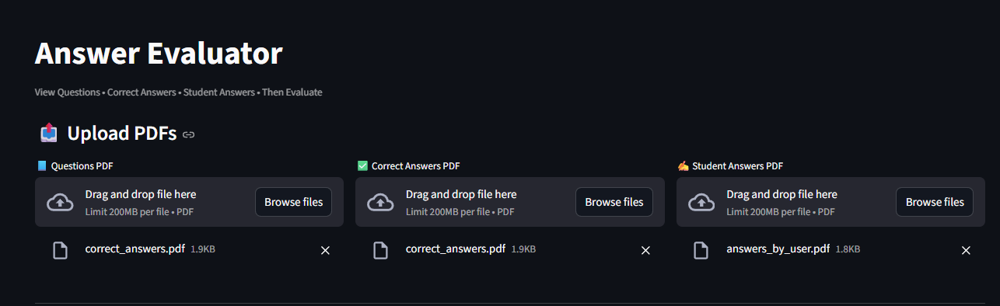
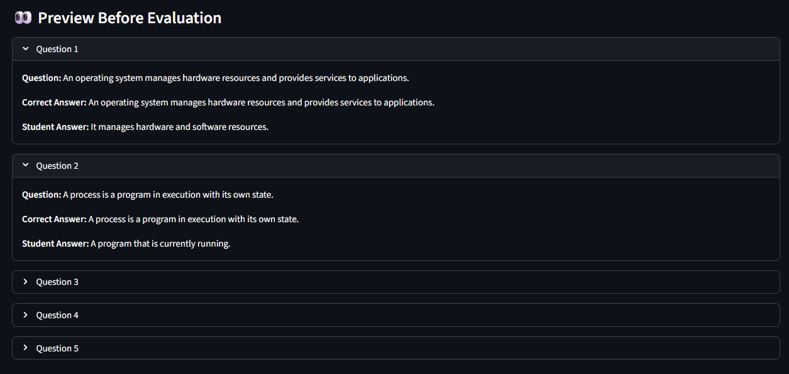

# Answer Evaluator – Streamlit App

An AI-powered **Answer Evaluation System** built using **Streamlit** and **Groq LLM**.  
This application allows you to upload PDFs containing:

- Questions
- Correct Answers
- Student Answers

The system displays all three clearly and then evaluates the student answers automatically.

---

## Features

- Upload **three PDFs** (Questions, Correct Answers, Student Answers)
- Preview all content **before evaluation**
- AI-based answer evaluation using **Groq LLM**
- Explanation for incorrect answers
- Automatic marks calculation (out of 2 per question)
- Displays **total marks**

---

##Tech Stack

- **Python**
- **Streamlit**
- **Groq LLM (LLaMA 3.1)**
- **PyPDF2**
- **dotenv**

---
## Screenshots

### Upload PDFs


### Preview Answers


### Evaluation Result


---

##Project Structure

answer-evaluator/
│
├── app.py # Main Streamlit application
├── requirements.txt # Required Python packages
├── README.md # Project documentation
└── .env # API key (not to be pushed to GitHub)


---

##Environment Setup

Create a `.env` file in the project root and add your Groq API key:

```env
GROQ_API_KEY=your_api_key_here
```
How to Run

Install dependencies:
```
pip install -r requirements.txt
```

Run the app:
```
python -m streamlit run evaluator.py
```
